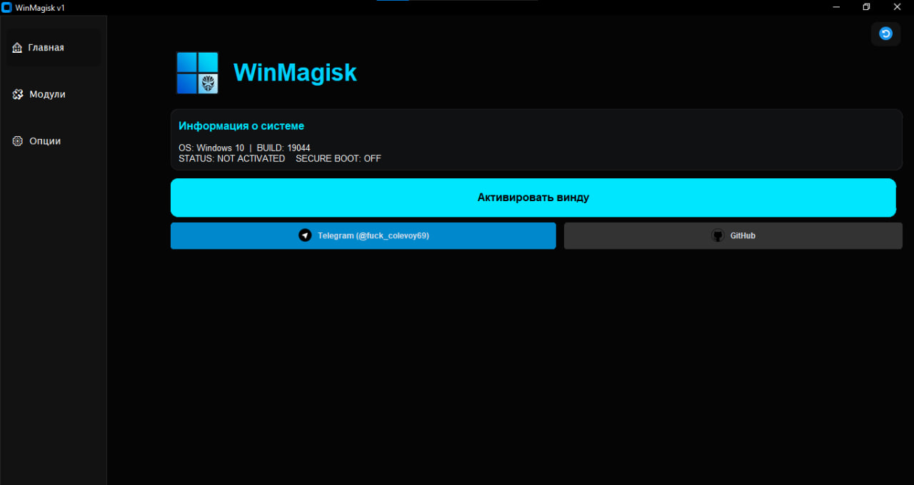

 WinMagisk v1

**WinMagisk** — это открытый инструмент для глубокой настройки и оптимизации Windows. Мы перенесли концепцию "модульности" из мобильного мира в десктопную систему, предоставив удобный GUI для управления сложными твиками и скриптами.

⚠️ Отказ от ответственности (Disclaimer)
Данное программное обеспечение предоставляется "как есть". Внесение изменений в системные файлы и реестр Windows может привести к нестабильной работе системы. Автор не несет ответственности за любой ущерб, вызванный использованием данного софта. Используйте на свой страх и риск.

---

## ✨ Основные функции

* **📊 System Monitor:** Мгновенная проверка статуса Secure Boot, версии билда и активации системы.
* **🧩 Module Engine:** Удобный запуск и управление сторонними модулями (.ps1, .bat, .exe, .py).
* **⚡ Quick Power Actions:** Перезагрузка в BIOS, Безопасный режим и сброс видеодрайверов в один клик.
* **🛡️ Security Checks:** Встроенная проверка критических настроек перед внесением изменений.

---

🤝 Open Source & Contributing
Проект является полностью Open Source. Я верю в прозрачность софта, который работает с системой.

Нашли баг? Откройте Issue.

Есть идея? Сделайте Fork, внесите изменения и отправьте Pull Request. Или напишите мне в телеграмм @fuck_colevoy69
